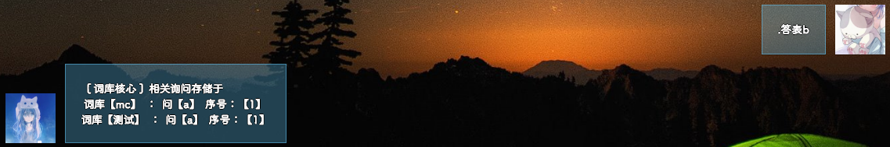
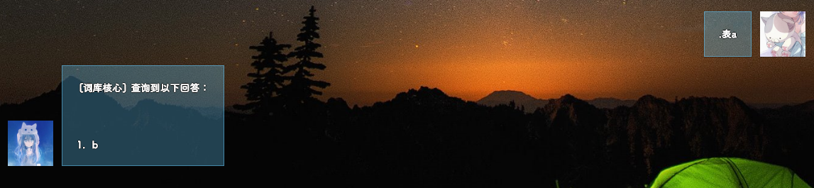
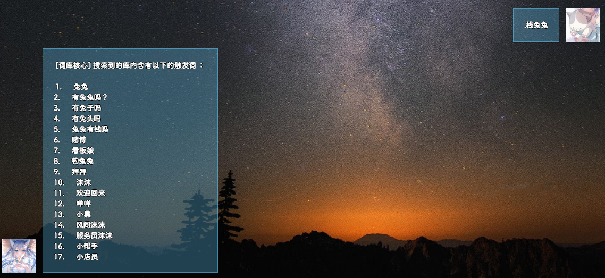
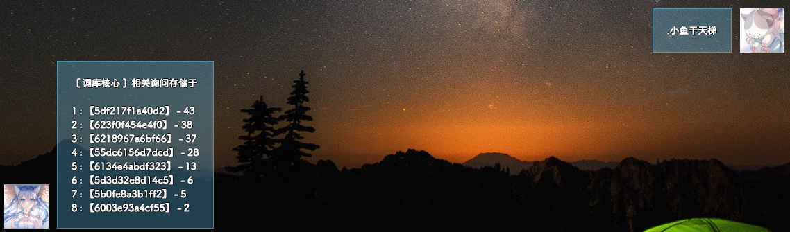

# 快速入门
在搭载词库的机器人的`群/私聊`上发送：`.问a答b`  
此时我们发送a，机器人即可回答b。  
  
***
  
# 基础概念
bot含含有一些基础概念：
1. 触发词与回复语
2. 词库组件及其存储位置
3. 云端导入导出

词库可在私聊使用。

***

## 1 触发词与回复语
机器人检测到触发词后会回复我们设定的回复语。
> PS.  当拥有多个回答时会随机抽取一个回答输出

***

## 2 词库组件及其存储位置
词库为一个个.json文件组成的，每个.json文件被称为一个词库组件，当我们添加**触发词与回复语**的时候会向**默认词库**组件内添加（添加到 `默认.json`）

当词库组件文件放入`data/word/wordData`文件夹内后，即可直接加载并运行

***

## 3 云端导入导出
词库组件可以通过某命令上传到云端服务器，并提供一个词库码，使用词库码可下载所对应的词库并导入。
  
***
  
# 词库命令词典
注意： `<>`代表为必填项，`<>`内的内容则为需要填写的内容  
## 编辑词库类  
### 1. 添加词库
在当前词库组件中设定触发词及回复。  
命令格式：.问`<触发词>答<回复词>`  
使用场景：  
我希望机器人在看见`a`后显示`b`  
使用如下命令：  
`.问a答b`  
  
  

此时运行结果：  
  
  
  
***
  
  
### 2. 删除词库
取消当前词库组件内的一个触发词的一个或全部回复  
命令格式: .删`<触发词>`序号`<all/序号>`  
  

使用场景：  
触发词`a`含有回答词`b`与回答词`c`  

我希望删除触发词`a`的第一条`回复词`  
  
  
我希望删除触发词`a`的全部`回复词`
  
  
***
  
    
### 3. 更改当前编辑的词库组件
选择编辑的词库组件  
命令格式： .入库`<库名>`  
  
使用场景：  
我们想要编辑一个名为`mc`的词库组件  
  
  
  
***
  
### 4. 编辑默认组件
选择编辑的词库组件为`默认`  
命令格式： .出库  
  
使用场景：  
我们想要编辑默认词库  
  
  
  
***
  
## 查询词库类  
### 1. 查看某触发词在哪个词库组件
查看某触发词的在哪个词库  
命令格式： .问表`<触发词>`  
  
  
使用场景：  
不知触发词`a`在哪个词库  

我需要查询它  
  
  
***
  
### 2. 查看某个回答在哪个词库组件的哪个触发词内
查看某回答词的在哪个词库  
命令格式： .答表`<回答词>`  
  
  
使用场景：  
不知回答词`b`在哪个词库  

我需要查询它  
  
  
***

### 3. 显示当前此词库组件内某个触发词的所有回答
查看当前词库内某`触发词`的所有`回复词`  
命令格式： .表`<触发词>`  
  
使用场景：  
我们查看触发词`a`的全部`回答词`  
  
  
***
  
### 4. 查看词库组件列表
查看当前所有的词库组件
命令格式： .库表  
  
使用场景： 
我们想要查看有哪些词库组件  

  
***
  
### 5. 查看词库内含有哪些触发词
查看某词库组件所含有的触发词  
命令格式： .栈`<组件名>`  
  
使用场景： 
我们想要查看一个名为`兔兔`的词库组件内的`触发词`  

  
***
  
### 6. 查看某种物品的排行榜
查看某物品的拥有排行榜  
命令格式： .`<物品名称>`天梯  
  
使用场景： 
我想要查看小鱼干的数量排行榜  

  
***
  
## 控制词库类
### 1. 设定词库op
将某人设定为词库的op  
命令格式： .wop`<唯一标识>`  
  
使用场景： 
将某人设定为词库op  

  
***
  
### 2. 取消词库op
取消某人设定的词库op权限  
命令格式： .wdeop`<唯一标识>`  
  
使用场景： 
取消某人设定的词库op权限  

  
***
  
### 3. 上传词库到服务器
上传词库组件到公共服务器  
命令格式：  .上传`<词库组件名>`  
返回值：    一个词库码

使用场景： 
将名为`默认`的词库组件上传至服务器  

  
***
  
### 4. 下载服务器内存储的词库
从公共服务器中下载词库到本地  
命令格式： .下载`<词库码>`:`<保存到的词库组件>`  
  
使用场景： 
从公共的服务器中下载一个指定的词库到名为`1233`的词库组件中  

  
***
  

