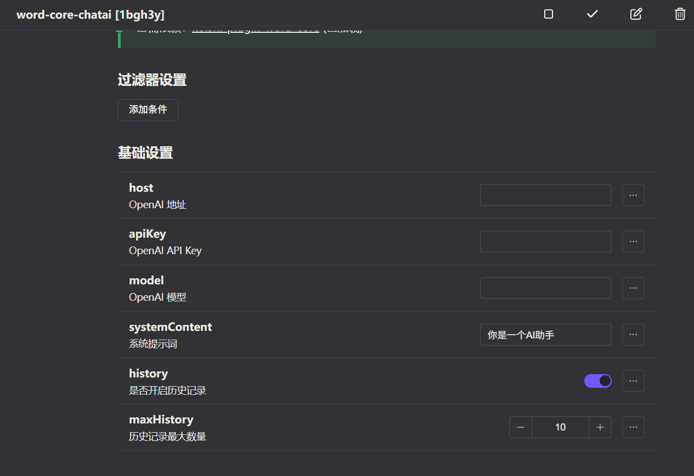

---

outline: [2,3]
---

# koishi-plugin-word-core-chatai [词库AI召唤器]

## 简介

词库引擎，OpenAI接口调用

启用此插件后，插件会提供一个新的语法，能够使用这个语法来接入OpenAI接口协议的ai接口。

## 使用方法

### 插件配置

- 说明：

在控制台处，

1. host是必填的，格式是https://xxxxxx/v1
2. apiKey是必填的？）
3. 模型是必填的！
4. 系统提示词处可以编写ai的人格

### 使用方式

|作用|语法格式|返回值|
|:--:|:--:|:--:|
|向ai说xxx|(ai:`<xxx>`)|`ai的回复`|
|将触发词作为问题向ai发起|(ai)|`ai的回复`|

- 举例：

|作用|完整词库指令|返回值|
|:--:|:--:|:--:|
|当有人发你好时，让ai生成回复|word.add 你好 (ai:请生成欢迎我的一段话)|你好呀！|
|当有人发你好时，让ai生成回复|word.add 你好 (ai)|你好呀！|

### 详细教程

[关于词库接入openai的详细教程与big胆的想法](https://forum.koishi.xyz/t/topic/10836/2)