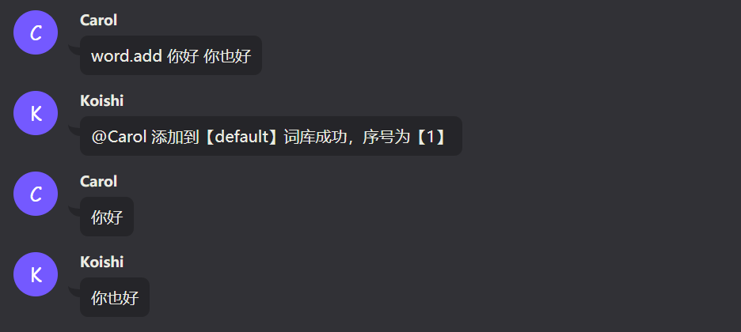
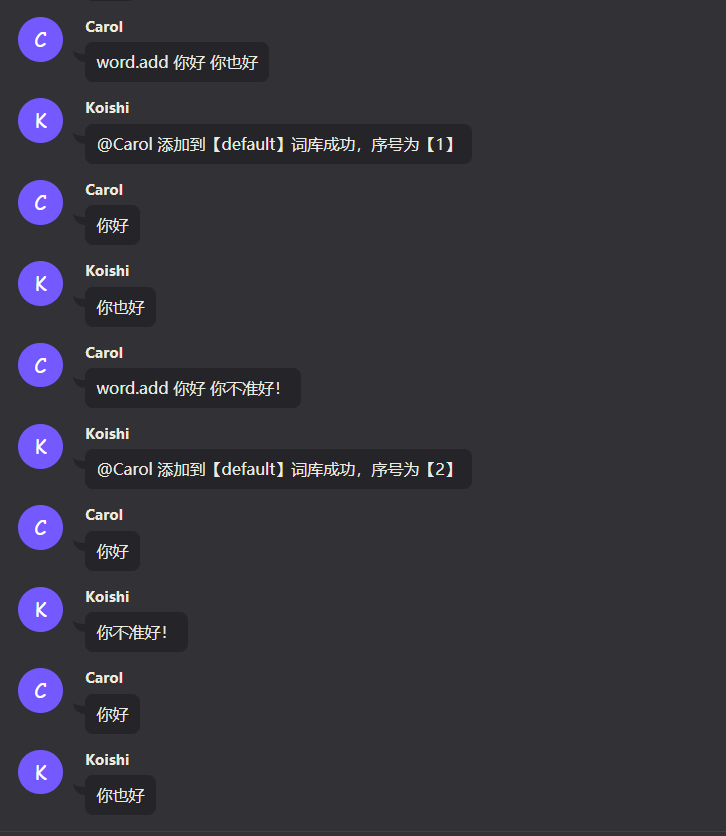
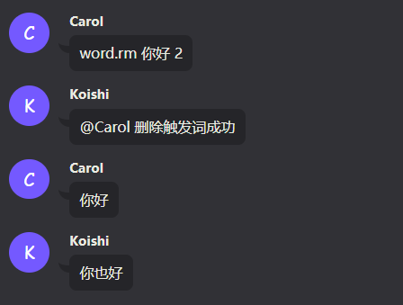
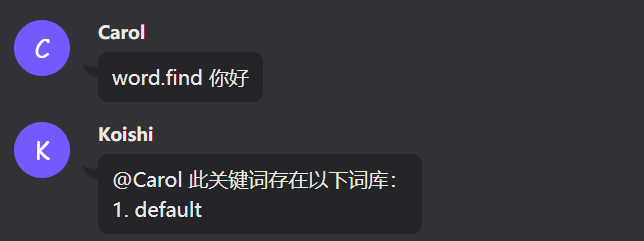
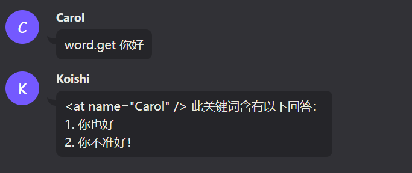

# koishi-plugin-word-core<br>[词库主插件]

## 简介

word-core词库插件，是一个编辑机器人问答的插件

问：我们称作`触发句`

答：我们称作`回复句`

## 注意事项

#### 1. 作者及存储格

在 **成功添加问答** 后，词库才会在数据库内生成真正的存储数据结构，只有在有存储数据结构的时候，才可以进行作者和存储格的修改
   
#### 2. 参数

词库有 **必填参数** 和 **选填参数**
    
下方的`<>`表示命令的必填参数，`[]`表示选填参数

#### 3. 更好的使用体验

最好与`grammar-basic`搭配使用以获得更完整体验

## 使用方法

### 基础部分

#### 1. 添加词库

- 基本语法：

```
word.add <触发句> <回复句>
```

- 举例：

比如我们想要实现：说出`你好`后，让机器人回复`你也好`<br>
只需要输入如下指令：

```
word.add 你好 你也好
```

- 效果：



- 特殊语法：

当命令中 **参数项** 需要有 **空格** 或者 **特殊符号** 的时候，需要将触发句或者回复句前后加上 **"** 符号<br>
只需要输入如下指令：

```
word.add "<触发句>" "<回复句>"
```

- 举例：

比如我们想要实现：说出`g i a o!`后，让机器人回复`好好好...是是是`<br>
只需要输入如下指令：

```
word.add "g i a o!" "好好好...是是是"
```

- 关于多个回答：

同一个 **触发句** 可以添加多个 **回复句**<br>
当有人发送 **触发句** 时，词库会随机抽取一条 **回复句** 回复

- 效果：



#### 2. 删除词库

我们在上面添加词库的章节中，看到了每次添加都会有 **序号** 的出现，删除一条 **回复句** 很简单

- 语法：

```
word.rm <触发句> <序号>
```

- 举例：

比如我们需要删除上述“关于多个回答”章节添加的`你不准好！`那个回复<br>
只需要输入如下指令：

```
word.rm 你好 2
```

- 效果：



#### 3. 设置编辑的词库

词库拥有多个存储库，用户编辑的每条词库默认存储在 **default** 词库，我们也可以通过指令，来设置需要编辑的词库

- 语法：

```
word.setedit [库名]
```

当 **库名** 为空时，表示编辑 **default** 库

- 举例：

比如我们想要 **编辑/创建** 名为 **测试** 的库<br>
只需要输入如下指令：

```
word.setedit 测试
```

Ps： **库名** 可以设置为不存在的词库，添加问答的时候会自动新建库

#### 4. 查看当前正在编辑的库

当我们不知道当前正在编辑哪个词库的时候，可以使用如下命令查看

- 语法：

```
word.readedit
```

#### 5. 寻找某个触发句所在的库

当我们忘记某个触发词在哪个库的时候，可以使用此命令查找

- 语法：

```
word.find <触发句>
```

- 举例：

比如我们忘记`你好`在哪个词库的时候<br>
只需要输入如下指令：

```
word.find 你好
```

- 效果：



#### 6. 查看当前库某触发句的所有回复句

当我们忘记某 **回复句** 的序号，或需要查看当前编辑的词库的某触发词下的所有 **回复句** 

- 语法：

```
word.get <触发句>
```

- 举例：

比如我们想要查看`你好`这一 **触发句** 在当前编辑的词库中的所有 **回复句** <br>
只需要输入如下指令：

```
word.get 你好
```

- 效果：



#### 7. 查看当前库所拥有的所有触发句

我们可以使用如下指令查看当前编辑的库下的所有 **触发句**

- 语法：

```
word.getdb
```

### 进阶部分

#### 玩家数据概念

##### 1. 背包

每个词库的 **触发者** 都会建立一个 **背包** ，背包是用来存储用户数据的，背包内包含若干个 **存储格**

##### 2. 存储格

**存储格** 是用来存储某个库产生的数据的<br>
词库的每个 **库** 都可以设置一个 **存储格** ，默认存储格为 `default`<br>
当库需要读取或写入用户数据时，会读取背包内对应的存储格<br>
这样便可以做到每个库的物品隔离<br>

比如你创建了一个文字游戏的库，名为`功夫1`，并设置它的存储格为`功夫系列`<br>
等后续你想开发第二部`功夫2`的时候，你也可以将它的存储格设置为`功夫系列`<br>
此时，两个词库共用一个存储格，便可以实现物品互通<br>
如果此时还有个`武林`库，设置存储格为`武林系列`那么，这个存储格和`功夫系列`的存储格便是隔离，不互通的

##### 3. 设置当前库的存储格

- 语法：

```
word.setsave <存储格>
```

- 举例：

比如我们想将存储格设置为`武林系列`<br>
只需要输入如下指令：

```
word.setsave 武林系列
```

##### 4. 恢复为默认存储格

- 语法：

```
word.resetsave
```

##### 5. 查看当前库的存储格

- 语法：

我们可以使用如下命令来查看当前编辑的库的存储格是什么

```
word.getsave
```

#### 权限相关概念

##### 1. 作者

每个词库在成功创建后，会将 **第一个为其添加词库的人** 设置为作者，后续此库仅允许作者添加，即使你拥有管理员权限也无权修改作者不为你的库<br>
每个库的作者，可以添加别的用户id来将其加入到此库的作者列中，从而一起编辑

##### 2. 权限

词库的每个库（即使是需要新建的库）都拥有自己的权限节点，编辑者需要满足权限才可以进行编辑。<br>
词库管理员级权限默认拥有词库的编辑权，但即使拥有编辑权的时候，还是需要判断你是否为词库作者

##### 3. 权限节点说明

```
编辑词库：word.edit.词库名
编辑所有词库：word.edit.*
为某人添加权限：word.admin.add
为某人删除权限：word.admin.rm
管理员级权限：word.admin.*
```

##### 4. 编辑词库的权限

当你需要编辑`你好`这个库时，你需要满足以下两个权限

    1. 权限：word.edit.你好
    2. 你为词库作者

##### 5. 设置某人为词库管理员

赋予对方`word.admin.*`权限

##### 6. 为某人添加权限

- 语法：

```
word.addp <用户id> <权限节点>
```

- 举例：

比如你需要给用户id为`5b0fe8a3b1ff2`的用户添加一个`word.edit.*`的权限<br>
只需要输入如下指令：

```
word.addp 5b0fe8a3b1ff2 word.edit.*
```

##### 7. 删除某人的权限

- 语法：

```
word.rmp <用户id> <权限节点>
```

- 举例：

比如你需要删除用户id为`5b0fe8a3b1ff2`的用户的`word.edit.*`的权限<br>
只需要输入如下指令：

```
word.rmp 5b0fe8a3b1ff2 word.edit.*
```

##### 8. 新增某人为当前库作者

- 语法：

```
word.addauthor <用户id>
```

- 举例：

比如你需要添加id为`5b0fe8a3b1ff2`的用户为当前你正在编辑的词库的作者<br>
只需要输入如下指令：

```
word.addauthor 5b0fe8a3b1ff2
```

##### 9. 取消某人为当前库作者

- 语法：

```
word.rmauthor <用户id>
```

- 举例：

比如你需要取消id为`5b0fe8a3b1ff2`的用户为当前你正在编辑的词库的作者<br>
只需要输入如下指令：

```
word.rmauthor 5b0fe8a3b1ff2
```

#### 其他

##### 1. 查看自己的id及名字

- 语法：

```
word.id
```