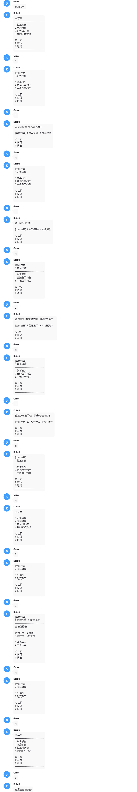

# koishi-plugin-smmcat-galmake<br>[自助菜单]

## 简介

通过创建文件夹生成对应映射关系的多级菜单选项的简单自助菜单插件

>无需学习写代码，只要您会新建文件夹和文件就可以创建类似 10086 自助查询的菜单

## 使用方法

`result.text` 中的内容代表最终的回复<br>
`title.text` 中的内容代表该层级菜单的标题

只要上述文件放置在对应文件夹中，就会有对应的效果

##### 1. 演示用模板

启用插件后，插件首次会在文件目录下生成演示内容以供参考

<figure>
  
  <figcaption>演示图片</figcaption>
</figure>

##### 2. 使用演示 GIF

通过使用 **/自助菜单** 指令，进入循环查询菜单操作流程（可随时退出），插件自带 **面包屑** 导航

<figure>
  
  <figcaption>演示GIF</figcaption>
</figure>

##### 3. smmの转义符

增加转义符的效果

- 内容：

```
%getTime% → 获取当前时间
%rollACGimg% → 获取随机动漫图片
```

Ps:目前该功能仅为尝鲜更新，内容不多

##### 4. 可选功能

word-core和word-core-grammar-basic是这个插件的附属插件。当他们被启用时。可以对`result.text` 与 `title.text` 中的词库语法进行解析

## 其他

##### 钓鱼小游戏Demo

- 内容：

```
一个渔场：可以使用不同的鱼竿钓鱼，品质不同的钓鱼竿能钓到不同数量的鱼
一个钓鱼商店：可以用鱼购买鱼竿
一个排行榜：可以看到自己的钓鱼排行榜和金币排行榜
一个查看个人属性：看个人属性）
```

- 效果图：

<figure>
  
  <figcaption>大概效果图（没截完）</figcaption>
</figure>

- 下载：

[下载Demo](./src/selfHelp.zip)